# Patient Intake Flow - Decision Tree Flowchart

```mermaid
flowchart TD
    A[Call Starts] --> B[Greet Patient & Ask for Pronouns]

    B --> C{Patient Email Provided?}
    C -->|No| D[Collect Email Address]
    C -->|Yes| E[Use Provided Email]
    D --> D1[Repeat Email Back for Confirmation]
    D1 --> D2{Email Correct?}
    D2 -->|Yes| E
    D2 -->|No| D3[Ask User to Spell Email Again]
    D3 --> D1

    E --> F[Check Patient Profile & Store User/Profile IDs]
    F --> G{Profile Exists?}

    G -->|No| H[Profile Creation Flow]
    G -->|Yes| I{Profile Complete?}

    I -->|Yes| J[Review Existing Info]
    I -->|No| K[Get Missing Fields]

    K --> L{Patient Wants to Complete Profile?}
    L -->|Yes| M[Collect Missing Fields Only]
    L -->|No| N[Skip Profile Update]

    M --> O[Update Patient Profile]
    O --> PR[Patient Registration Flow]
    N --> PR
    J --> PR

    H --> H1[Collect Basic Demographics]
    H1 --> H2[Collect Contact Information]
    H2 --> H3[Collect Communication Preferences]
    H3 --> H4[Collect Emergency Contact - Optional]
    H4 --> H5[Create Patient Profile]
    H5 --> PR

    PR --> PR1[Collect Chief Complaint & Current Symptoms]
    PR1 --> PR2[Collect Additional Symptoms]
    PR2 --> PR3[Collect Medical History - Allergies]
    PR3 --> PR4[Collect Current Medications]
    PR4 --> PR5[Collect Chronic Conditions]
    PR5 --> PR6[Collect Previous Surgeries]
    PR6 --> PR7[Collect Family History - Optional]
    PR7 --> PR8{Want to Provide Insurance?}
    PR8 -->|Yes| PR9[Collect Insurance Information]
    PR8 -->|No| PR10[Skip Insurance]
    PR9 --> PR11[Collect Consents]
    PR10 --> PR11
    PR11 --> PR12[Confirm All Patient Information]
    PR12 --> PR13{Information Correct?}
    PR13 -->|Yes| PR14[Create Patient Record with All Data]
    PR13 -->|No| PR15[Make Corrections]
    PR15 --> PR12
    PR14 --> Q{Emergency Symptoms?}

    Q -->|Yes| R[Advise Emergency Care/911]
    Q -->|No| T[Create Medical Ticket]

    T --> U[Explain Triage Process]
    U --> V[Monitor Ticket Status]
    V --> W{Ticket Status?}

    W -->|Doctor Needed| X[Transfer to Appointment Booking]
    W -->|Pharmacist Needed| Y[Transfer to Pharmacist]
    W -->|Still Processing| Z[Provide Update]
    Z --> V

    X --> END[Call Complete]
    Y --> END
    R --> END

    style A fill:#e1f5fe
    style END fill:#c8e6c9
    style R fill:#ffcdd2
    style Q fill:#fff3e0
    style G fill:#f3e5f5
    style I fill:#f3e5f5
    style L fill:#f3e5f5
    style W fill:#f3e5f5
    style D2 fill:#e8f5e8
    style PR8 fill:#f3e5f5
    style PR13 fill:#e8f5e8
    style PR fill:#fff8e1
    style PR1 fill:#fff8e1
    style PR2 fill:#fff8e1
    style PR3 fill:#fff8e1
    style PR4 fill:#fff8e1
    style PR5 fill:#fff8e1
    style PR6 fill:#fff8e1
    style PR7 fill:#fff8e1
    style PR9 fill:#fff8e1
    style PR10 fill:#fff8e1
    style PR11 fill:#fff8e1
    style PR12 fill:#fff8e1
    style PR14 fill:#fff8e1
    style PR15 fill:#fff8e1
```

## Decision Points Breakdown

### 1. **Email Collection Decision**

- **Condition**: Is {{patientEmail}} provided?
- **Actions**:
  - If No → Collect email from patient
  - If Yes → Use provided email

### 1a. **Email Confirmation Decision**

- **Condition**: Is the collected email address correct?
- **Actions**:
  - If Yes → Proceed with profile verification
  - If No → Ask user to spell email again and repeat confirmation

### 2. **Profile Existence Decision**

- **Condition**: Does profile exist in system?
- **Actions**:
  - If No → Start profile creation flow
  - If Yes → Check if profile is complete
- **Note**: Store user ID and profile ID for patient registration

### 3. **Profile Completeness Decision**

- **Condition**: Is existing profile complete?
- **Actions**:
  - If Complete → Review info and proceed to patient registration
  - If Incomplete → Check what fields are missing

### 4. **Profile Update Consent Decision**

- **Condition**: Does patient want to complete missing profile info?
- **Actions**:
  - If Yes → Collect only missing fields
  - If No → Skip to patient registration

### 5. **Patient Registration Flow** (Updated Order)

- **Sequential Steps**:
  1. **Collect chief complaint and current symptoms** (NEW FIRST STEP)
  2. **Collect additional symptoms**
  3. Collect medical history (allergies, medications, chronic conditions, surgeries)
  4. Collect family history (optional)
  5. Ask about insurance information
  6. Collect required consents
  7. Confirm all information (including symptoms)
  8. **Create patient record with ALL data including symptoms**

### 6. **Insurance Information Decision**

- **Condition**: Does patient want to provide insurance now?
- **Actions**:
  - If Yes → Collect insurance details
  - If No → Skip insurance (can be added later)

### 7. **Patient Information Confirmation Decision**

- **Condition**: Is all patient information (including symptoms) correct?
- **Actions**:
  - If Yes → Create patient record with all data and proceed to emergency check
  - If No → Allow corrections and re-confirm

### 8. **Emergency Assessment Decision**

- **Condition**: Are symptoms indicating emergency?
- **Actions**:
  - If Yes → Advise emergency care/911
  - If No → Continue with ticket creation

### 9. **Triage Result Decision**

- **Condition**: What does medical team recommend?
- **Actions**:
  - Doctor needed → Transfer to appointment booking
  - Pharmacist needed → Transfer to pharmacist
  - Still processing → Provide update and wait

## Key Tools Used at Each Stage

| Stage                    | Tools Required                                         |
| ------------------------ | ------------------------------------------------------ |
| Profile Verification     | `checkPatientProfile`                                  |
| Profile Creation         | `createPatientProfile`                                 |
| Profile Update           | `getProfileMissingFields`, `updatePatientProfile`      |
| **Patient Registration** | **`createPatient` (with symptoms + medical history)**  |
| Medical Ticket           | `createMedicalTicket`                                  |
| Monitoring               | `checkTicketStatus`                                    |
| Transfer                 | `transferToAppointmentBooking`, `transferToPharmacist` |

## Data Collection Requirements

### Required for New Profiles:

- firstName, lastName
- dateOfBirth
- phoneNumber
- email (already provided)
- address (street required, city/state/zip optional)
- communicationPreferences

### Optional for New Profiles:

- gender
- emergencyContact

### **Required for Patient Registration:** (Updated Order)

- **userId, profileId** (from profile verification)
- **Chief Complaint & Symptoms** (COLLECTED FIRST):
  - chiefComplaint (primary reason for call)
  - currentSymptoms (array with symptom/severity/duration/notes)
- **Medical History**:
  - allergies (array, empty if none)
  - currentMedications (array with name/dosage/frequency, empty if none)
  - chronicConditions (array, empty if none)
  - previousSurgeries (array with procedure/year, empty if none)
  - familyHistory (optional array)
- **Consents** (all required except marketing):
  - treatmentConsent (must be true)
  - dataProcessingConsent (must be true)
  - marketingConsent (optional)
- **Insurance** (optional but complete if provided):
  - provider, policyNumber, subscriberName, relationshipToSubscriber
  - groupNumber (optional within insurance)

### Required for Medical Tickets:

- patientId (reference to created patient record)
- ticketDetails (based on patient record and any additional notes)
